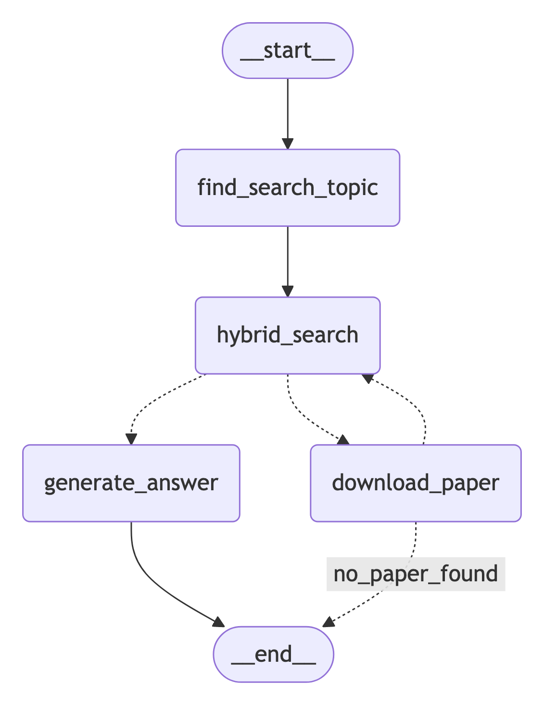

# ArXiv Research Assistant

The ArXiv Research Assistant is a powerful tool designed to search and summarize academic papers from arXiv using a combination of full-text and vector-based search techniques. It leverages MongoDB for storage, AWS Bedrock for embeddings, and Gradio for a user-friendly interface.

## Features

- Hybrid search combining full-text and vector-based techniques
- Paper fetching and downloading from arXiv
- Automatic summarization of research papers
- Interactive chat interface for querying and exploring research topics
- Integration with MongoDB for efficient storage and retrieval
- Utilization of AWS Bedrock for advanced language models and embeddings

## Installation

1. Clone the repository:
   ```
   git clone https://github.com/mohammaddaoudfarooqi/arXivSearch.git
   cd arXivSearch
   ```

2. Install the required dependencies:
   ```
   pip install -r requirements.txt
   ```

3. Set up your environment variables:
   - Copy the `sample.env` file to `.env`
   - Fill in your MongoDB URI and AWS credentials in the `.env` file

## Usage

To run the ArXiv Research Assistant:

```
python main.py
```

This will start the Gradio interface, which you can access through your web browser.

## Configuration

- `EMBEDDING_MODEL_NAME`: The AWS Bedrock model used for embeddings (default: "amazon.titan-embed-text-v1")
- `COMPLETION_MODEL_NAME`: The AWS Bedrock model used for text generation (default: "us.anthropic.claude-3-5-sonnet-20241022-v2:0")
- `MONGODB_DB_NAME`: The name of the MongoDB database (default: "mongodb_arxiv")
- `MONGODB_COLLECTION`: The name of the MongoDB collection (default: "documents")

These can be adjusted in the `main.py` file if needed.

## File Structure

- `main.py`: The main script containing all the logic for the ArXiv Research Assistant
- `requirements.txt`: List of Python dependencies
- `sample.env`: Template for environment variables

## Dependencies

Major dependencies include:
- langgraph
- pymongo
- arxiv
- python-dotenv
- httpx
- boto3
- langchain-aws
- pyppeteer
- gradio
- langchain-mongodb

For a complete list, see `requirements.txt`.

## Environment Variables

The following environment variables need to be set in your `.env` file:

- `MONGODB_URI`: Your MongoDB connection string
- `AWS_ACCESS_KEY_ID`: Your AWS access key ID
- `AWS_SECRET_ACCESS_KEY`: Your AWS secret access key

## Functions

- `setup_vector_search_index()`: Sets up the vector search index in MongoDB
- `hybrid_search()`: Performs a hybrid search with semantic boosting
- `fetch_arxiv_papers()`: Fetches papers from arXiv based on a search query
- `download_papers()`: Downloads and processes papers from arXiv
- `perform_hybrid_search()`: Executes the hybrid search on the MongoDB collection
- `find_search_topic()`: Extracts the main topic from a user query
- `generate_answer()`: Generates an answer based on retrieved documents
- `check_documents_extracted()`: Determines the next action in the workflow
- `check_downloaded_papers()`: Checks the state of downloaded papers
- `create_graph_nodes()`: Sets up the workflow graph
- `handle_query()`: Handles user queries and streams results

## Workflow

The assistant uses a graph-based workflow to process queries:

1. Extract search topic from user query
2. Perform hybrid search on existing documents
3. Download papers if necessary
4. Generate answer based on retrieved information



## UI

The user interface is built using Gradio, providing a chat-like experience for interacting with the research assistant.

## Author

Mohammad Daoud Farooqi

## License

This project is licensed under the MIT License. See the LICENSE file for details.